# Matting Studio — 架构图

> **配套**: `matting-studio-design.md` (设计文档), `algorithms.md` (算法细节)
> **状态**: Phase 0 设计产物 (2026-07-04)
> **技术栈**: Python 3.11 + PyTorch + ONNX Runtime + OpenCV + PyQt6 + FFmpeg

---

## 1. 系统架构 (System Architecture)

### 1.1 顶层流程图

```mermaid
flowchart LR
    subgraph Input["01 视频采集"]
        A[视频文件/直播流] --> B[FFmpeg 解码]
        B --> C[Frame 列表]
    end

    subgraph Preprocess["02 帧预处理"]
        C --> D[缩放 512×512]
        D --> E[归一化 0-1]
        E --> F[去噪/亮度均衡]
    end

    subgraph Matting["03 AI 抠像 (核心)"]
        F --> G1[RVM 主模型]
        F --> G2[YOLOv8-seg 二确认]
        G1 --> H[交集 = RVM α × YOLO mask]
        G2 --> H
        H --> I[Mask: alpha + foreground_rgb]
    end

    subgraph Postprocess["04 时序后处理"]
        I --> J1[3-5 帧 Alpha 中值]
        J1 --> J2[SAM2 互动修帧]
        J2 --> K[精炼 Mask]
    end

    subgraph Compose["05 合成渲染"]
        K --> L[Alpha 混合]
        L --> M[边缘羽化]
        M --> N[输出帧]
    end

    subgraph Export["06 编码输出"]
        N --> O[FFmpeg h264_nvenc]
        O --> P[MP4 文件 + 音频]
    end

    style Matting fill:#ffe0b2
    style Postprocess fill:#c8e6c9
```

### 1.2 8 模块依赖图

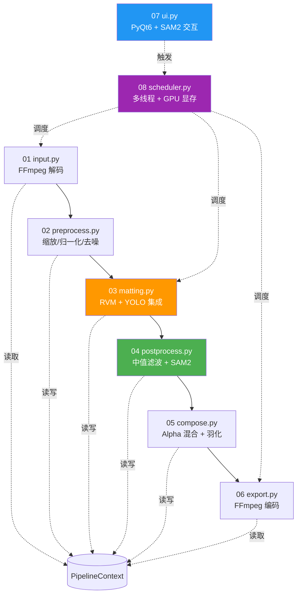

---

## 2. 数据流图 (Data Flow)

### 2.1 帧级数据流 (Per-Frame Pipeline)

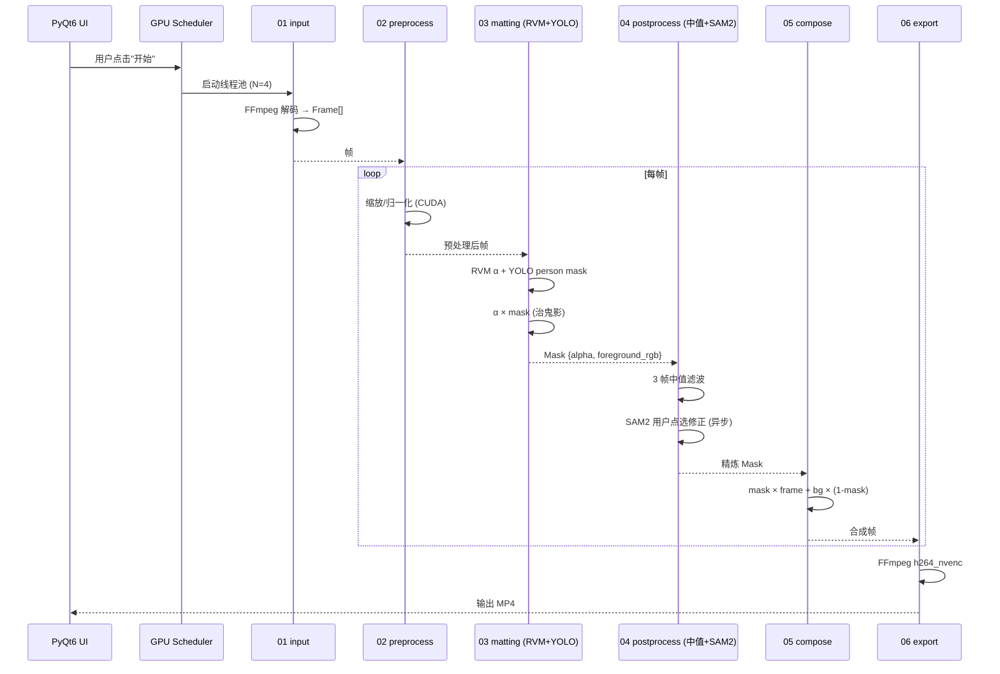

### 2.2 跨帧数据共享 (Cross-Frame State)

```mermaid
flowchart TB
    subgraph Context["PipelineContext (单例)"]
        Frames[frames: List[Frame]]
        Masks[masks: List[Mask]]
        Background[background: ndarray]
        Config[config: dict]
        State[state: dict<br/>last_mask, sam2_repairs]
        GPU[gpu_memory_mb: int]
    end

    Input --> Frames
    Matting --> Masks
    User[用户选背景] --> Background
    CLI[--config YAML] --> Config
    SAM2[SAM2 修帧] --> State
    Scheduler --> GPU

    Frames --> Preprocess
    Preprocess --> Matting
    Masks --> Postprocess
    Background --> Compose
    Config --> Pipeline
    State --> Postprocess
    GPU --> Scheduler
```

---

## 3. 模块状态机 (Pipeline State Machine)

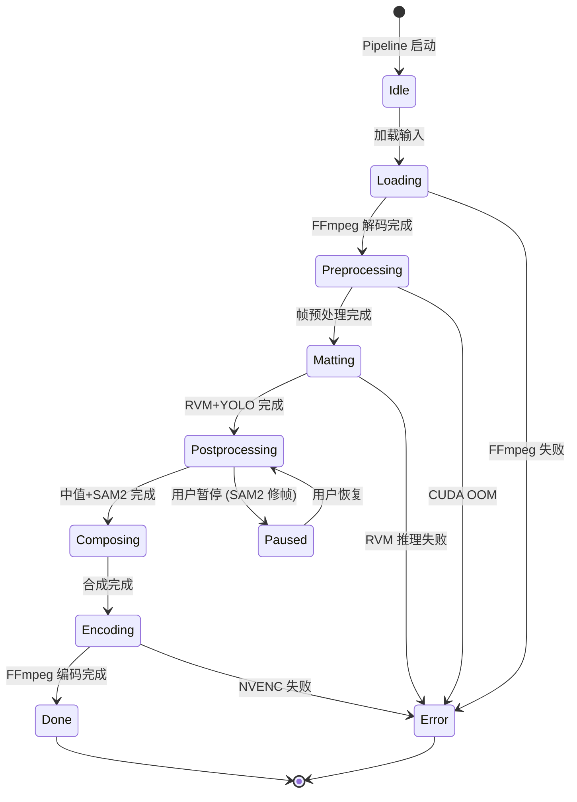

---

## 4. 部署架构 (Deployment)

### 4.1 硬件分层

```mermaid
graph TB
    subgraph GPU["GPU 层 (CUDA)"]
        RVM[RVM 模型<br/>~2GB 显存]
        YOLO[YOLOv8-seg<br/>~4GB ONNX arena]
        SAM2[SAM2 Hiera Large<br/>~2GB 显存]
        NVENC[h264_nvenc<br/>~200MB 显存]
    end

    subgraph CPU["CPU 层"]
        FFmpeg[FFmpeg 解码/编码]
        Preprocess[OpenCV 预处理]
        Compose[OpenCV 合成]
        UI[PyQt6 主线程]
    end

    subgraph RAM["RAM 层 (≥16GB)"]
        Frames[帧队列 ~2GB<br/>10s 30fps 1080p]
        Masks[Mask 队列 ~1GB]
        SAM2Rep[SAM2 修复缓存 ~500MB]
    end

    subgraph Disk["磁盘层 (SSD 推荐)"]
        Input[输入视频]
        Output[输出 MP4]
        Models[模型权重 ~500MB<br/>git-lfs]
        Cache[临时 JPEG 序列 ~5GB<br/>(可选, 视频长时)]
    end

    UI --> CPU
    CPU --> RAM
    RAM --> GPU
    GPU --> Disk
```

### 4.2 进程模型

```mermaid
graph LR
    subgraph Main["主进程 (Python)"]
        UI[PyQt6 UI]
        Engine[Pipeline Engine]
        Sched[GPU Scheduler]
    end

    subgraph Worker["工作进程 (子进程/线程)"]
        W1[Worker 1: input+preprocess]
        W2[Worker 2: matting (RVM+YOLO)]
        W3[Worker 3: postprocess (SAM2)]
        W4[Worker 4: compose+export]
    end

    UI --> Engine
    Engine --> Sched
    Sched --> W1
    Sched --> W2
    Sched --> W3
    Sched --> W4

    W1 -.Frame.-> W2
    W2 -.Mask.-> W3
    W3 -.Mask.-> W4
```

---

## 5. YOLOv8 + RVM 治鬼影数据流 (核心创新)

```mermaid
flowchart TB
    subgraph RVM["RVM (主抠像)"]
        Frame[输入帧] --> RVMEnc[Encoder<br/>MobileNetV3]
        RVMEnc --> RVMLSTM[LSTM<br/>时序记忆]
        RVMLSTM --> RVMDec[Decoder]
        RVMDec --> RVMAlpha[α_mask<br/>(H, W) float32]
    end

    subgraph YOLO["YOLOv8-seg (二确认)"]
        Frame --> YOLOBB[Backbone]
        YOLOBB --> YOLOFPN[FPN]
        YOLOFPN --> YOLOHead[Detection Head<br/>cls=0 person]
        YOLOHead --> YOLOMask[person mask<br/>(H, W) float32]
    end

    RVMAlpha --> Multiply[α × yolo_mask]
    YOLOMask --> Multiply
    Multiply --> FinalMask[final mask<br/>治 RVM 远处半透真人]
```

**数学证明** (治鬼影):
- RVM α: 真人区 α≈1, 远处半透区 α≈0.3, 背景区 α≈0
- YOLO mask: 真人区 mask=1, 远处半透区 mask=0 (YOLO 不识别), 背景区 mask=0
- 交集: 真人区=1, 远处半透区=0, 背景区=0 = **剔除 RVM 远处幻觉**
- 噪点保护: RVM 2075 个低 α 噪点 (α<0.05) × YOLO mask (噪点区 mask=0) = 0 = **剔除噪点**

---

## 6. SAM2 互动修帧工作流

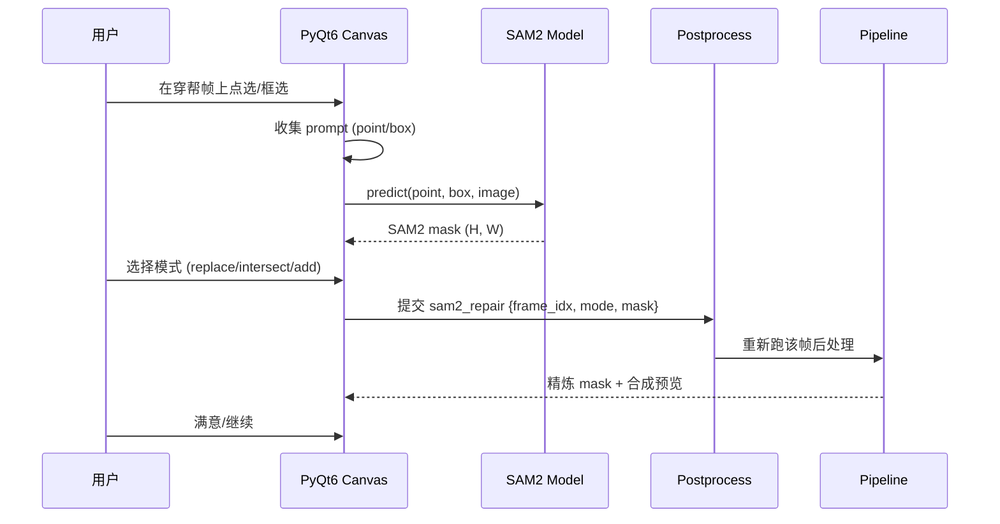

---

## 7. 显存管理 (GPU Memory Management)

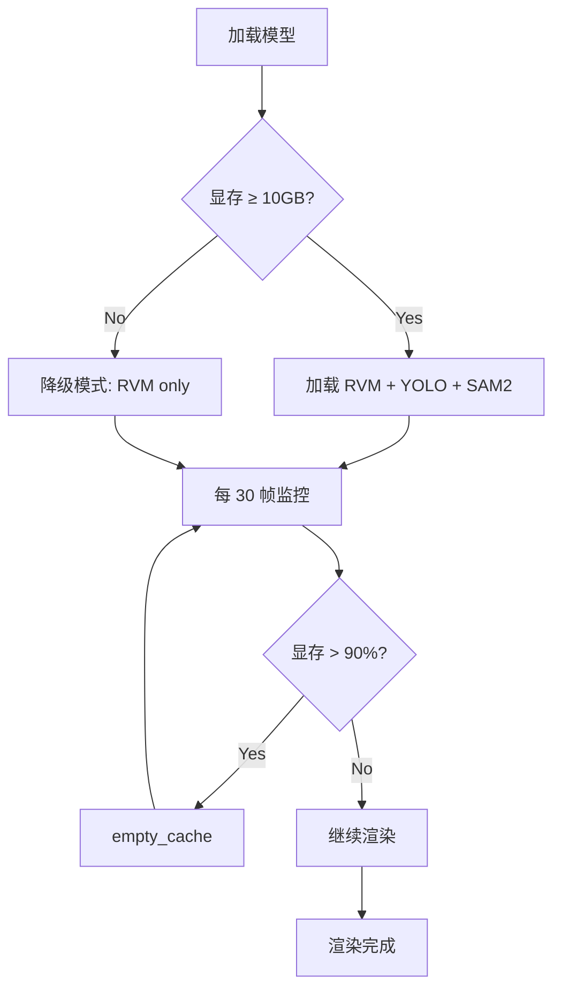

**降级策略**:
1. **完整模式** (≥10GB): RVM + YOLO + SAM2 (默认)
2. **轻量模式** (6-10GB): RVM + YOLO (无 SAM2, 修帧功能禁用)
3. **最低模式** (<6GB): 仅 RVM (YOLO 治鬼影禁用)

---

## 8. 配置文件流 (YAML Config)

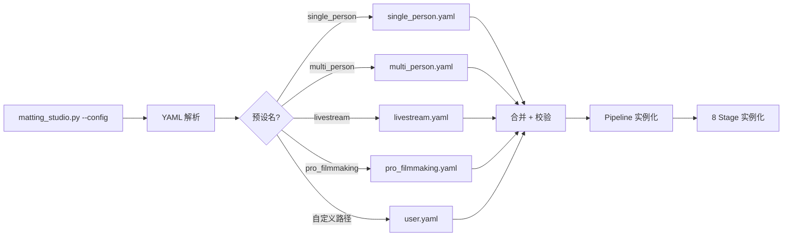

**预设继承** (YAML supports anchors):
```yaml
# base.yaml
base: &base
  edge_feather: 11
  encoder: h264_nvenc
  bitrate: 10M

# single_person.yaml (继承 base)
<<: *base
name: single_person
matting:
  use_yolo_ghost_filter: true
```

---

## 9. 错误处理流 (Error Handling)

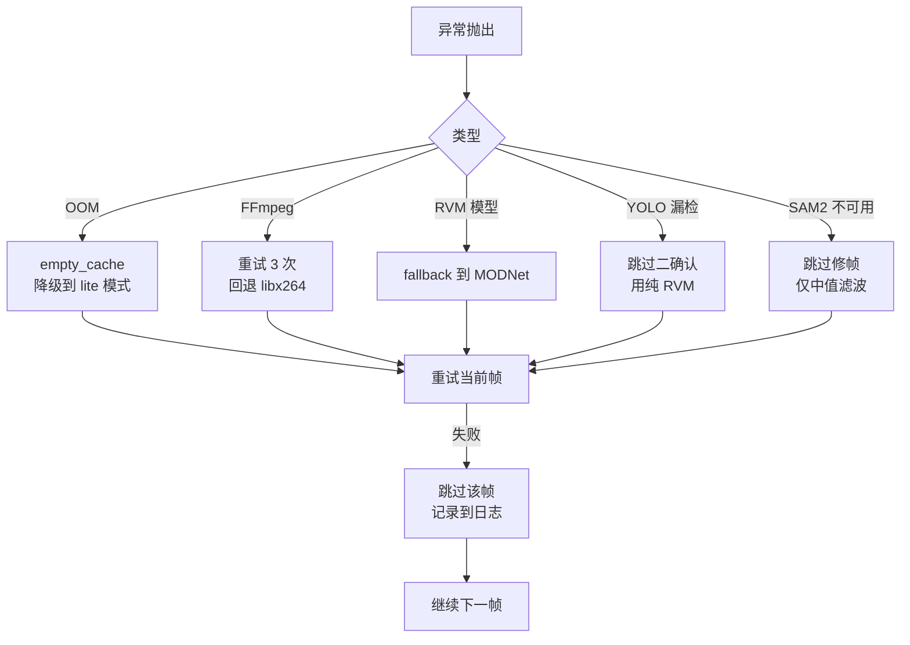

---

## 10. 关键指标 (Key Metrics)

| 指标 | 目标 | 测量方法 |
|------|------|---------|
| **抠像精度 (mIoU)** | ≥0.95 | DAVIS 2017 测试集 |
| **时序一致性 (tLP)** | ≤5 像素 | 连续帧 alpha 边缘差 |
| **处理速度** | 1080p 30fps (单 GPU) | FPS 计时器 |
| **显存占用** | ≤10GB (RVM+YOLO+SAM2) | nvidia-smi |
| **启动时间** | ≤5 秒 (CLI) | 时间戳 |
| **测试覆盖** | ≥110 测试 (主管线现标准) | pytest |

---

## 11. 扩展性设计 (Extensibility)

### 11.1 插件式 Stage

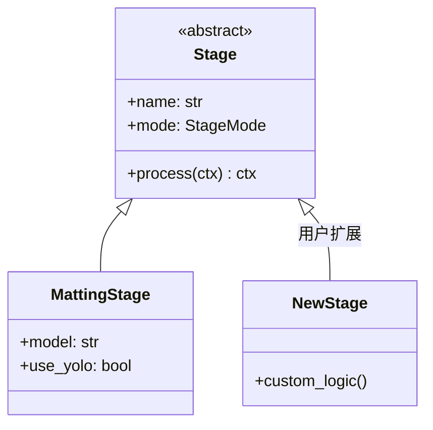

### 11.2 多模型动态切换

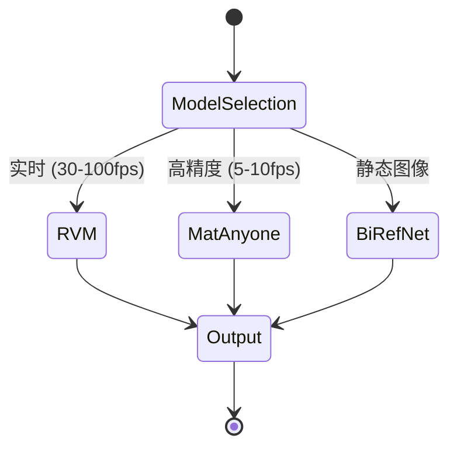

---

## 12. 与本项目 (fitness-video-pipeline) 的关系

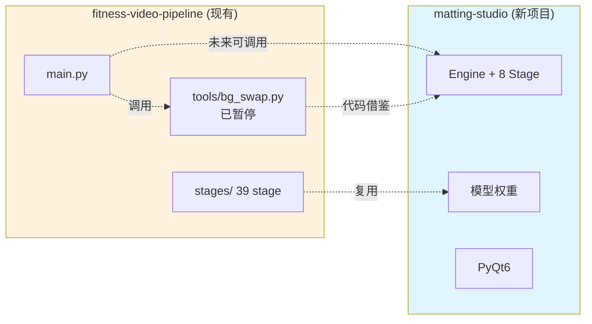

**关键点**:
- `matting-studio` 是**独立新项目**, 不依赖 `fitness-video-pipeline`
- `bg_swap` 的 RVM/YOLO/SAM2 集成经验**代码借鉴**到新项目
- `fitness-video-pipeline` 未来可**调用** `matting-studio` 作为外部工具
- 2 个项目**独立发布**, 独立版本号, 独立 CI

---

## 附录: mermaid 渲染检查

本文档所有 mermaid 图用 [mermaid.live](https://mermaid.live) 或 GitHub Markdown 渲染器可直接预览.
GitHub Actions CI 也会用 `markdownlint` + `mermaid-cli` 校验语法.

---

**下一步**: `docs/algorithms.md` (算法细节, 论文级) + 创建新 GitHub repo 脚手架.
